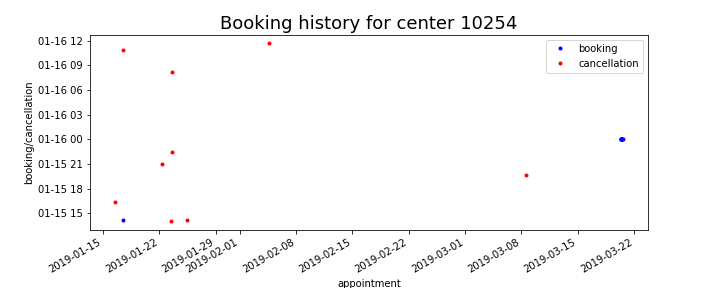

# Blood test appointment booking via UHCW's web portal #

The [University Hospitals - Coventry &
Warwickshire](https://www.uhcw.nhs.uk) (UHCW) has a set up a [web
portal](https://www.swiftqueue.co.uk/uhcw.php) to facilitate the
booking of blood test apptointments in Coventry (UK) from 18 test
centers. 

This project tracks the available appointments by downloading the data
hourly (ideally).  With the data it is also possible to
**reconstruct** the booking history of an appointment, that is, the
times it was booked as well as those where it was cancelled.

Other questions of interest:  
1. Which test centers have the longest or shortest wait time to the
   next available appointment?  
2. How are appointments distributed over the city?  
3. Can one identify features to predict which centers are booked
   quicker, such as distance to city center?  
4. Are booking patterns similar or different from one center to
   another?   
5. How often and when are appointments cancelled?  
6. How far ahead of time are appointments booked?  

The dataset contains the following information on each *test center*:  
1. **name**  
2. **id number**  
3. **address**  
4. **geocoordinates** (latitude and longitude)  
5. center's **web** address  
6. **appointments URL**  
7. **age group** served (children or adults)  

The dataset contains the following information on each *appointment*:  
2. **appointment timestamp** (date and time of appointment)  
1. **grab timestamp** (date and time data is collected)  
3. **center id**  
4. **age group** served (children or adults)  
5. **test type** (blood test, INR test, fasting bloods, non-fasting
   bloods, glucose tolerance test)  

