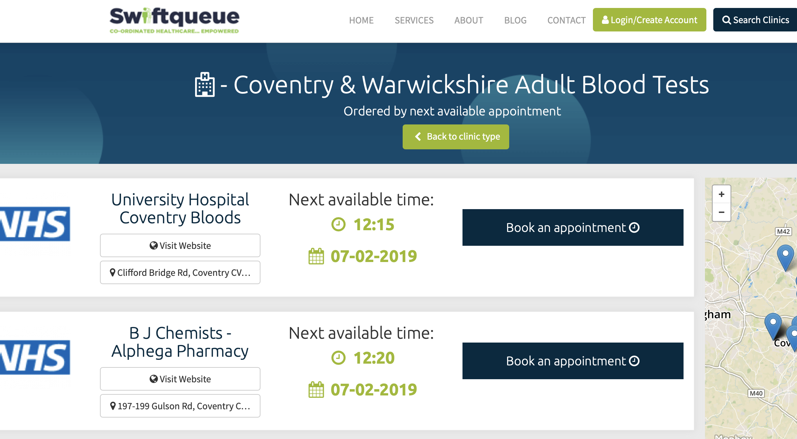
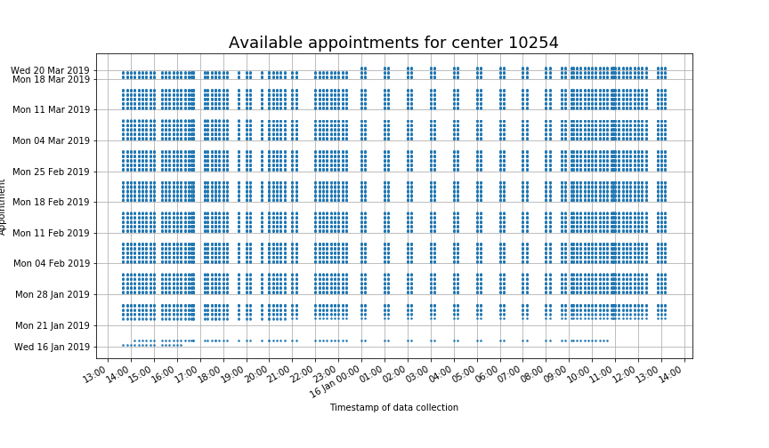
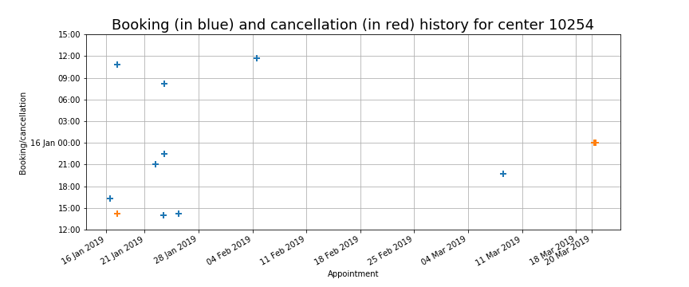

# Blood test appointment booking via UHCW's web portal #

The [University Hospitals - Coventry &
Warwickshire](https://www.uhcw.nhs.uk) (UHCW) has a set up a [web
portal](https://www.swiftqueue.co.uk/uhcw.php) to facilitate the
booking of blood test appointments in Coventry (UK) from 18 test
centers. 

The dataset `attendance.csv` contains information about available
appointments at the participating test centers.  The data is collected
hourly (approximately, sometimes more often).

## Goals
In this project we aim to address the following types of questions.

1. Which test centers have the longest or shortest wait time to the
     next available appointment?  
1. What features, such as distance to city center, are more likely to
     predict which centers are booked quicker?  
1. Are there any salient patterns in the booking and cancellation
   behavior of the patients?

**Note.** This project is in its preliminary phase.  For speed, we
work with a relatively small subset of the full dataset `appointments.csv`.

## Understanding the UHCW dataset
Following is a summary of preliminary findings obtained from the
Jupyter notebook `UHCW_EDA.ipynb`.

- There are:
  - 18 test centers,
  - serving 2 age groups ("adult" and "child"),
  - delivering collectively a total of 5 different test types,
    labeled:
     - 'Blood Test'
     - 'INR Test',
     - 'Fasting Bloods',
     - 'Non Fasting Bloods',
     - 'Glucose Tolerance Test'
- Each test center serves only 1 age group.
- Each center delivers 1, 2, or 3 different types of test.
- The centers open their appointments for booking with a varying number of days ahead of time, between 52 and 125.
- Most centers which deliver tests of multiple types put the appointments for all types at the same time.

## Case study with center 10254
Let's take a look for example at the data for center 10254.
Information on the test centers can be extracted out of `centers.csv`.
A blue dot on the table below indicates an available appointment at
the time of scraping.

It is not very easy to read, but it illustrates some of the features
of the dataset.

- The data was collected over a period of roughly 24 hours.  Also, the
  data was not collected at regular times: during the night, data was
  collected around each hour.  During the day, data was collected
  mostly regular, with short gaps.  This is due to the fact that the
  data was collected on my personal laptop, which goes to sleep when
  not used, or which I had to close when moving places.  These
  technical challenges are by now mostly overcome, as I am now
  collecting the data on a separate laptop dedicated for this purpose.
- The platform does not display all appointments in the
  future. Rather, only the appointments up to about 21 March 2019 are
  open for booking.  In fact, a closer look reveals that new
  appointments on 20 Mar 2019 are open for booking starting at
  midnight on 16 Jan 2019.  
- Most appointments are booked for the following week, while all later
  appointments appear to be available.

### Reconstructing the booking history
An important part of this project is to extract meaningful and
accurate information from this data.  In particular, the code in the
notebook `UHCW_reconstruction.ipynb` **reconstructs** the booking
history of the appointments at all test centers.  For example, the
code produces a representation of the booking history such as in the
image below, where a blue cross represents a booking and a red cross
represents a cancellation at center 10254.

### Dealing with artefacts
From the plot it would appear that appointments have been cancelled on
20 Mar 2019.  This turns out to be an artefact of the appointments
being put online for booking only for roughly two months ahead of
time.  This is the kind of issue that this project needs to handle in
its preliminary phase.

## Datasets

The dataset `centers.csv` contains the following information on each *test center*:  

1. `name`  
1. `id` number  
1. postal `address`  
1. geocoordinates (`latitude` and `longitude`)  
1. center's `web` address  
1. `appointments URL`  
1. `age group` served (children or adults)  

The datasets `sample_appointments.csv` and `appointments.csv`
(available on
[kaggle](https://www.kaggle.com/antoinechoffrut/uhcwappointments))
contain the following information on each *appointment*:

1. `appointment timestamp` (date and time of appointment)  
1. `grab timestamp` (date and time data is collected)  
1. `center id`  
1. `age group` served (children or adults)  
1. `test type` (blood test, INR test, fasting bloods, non-fasting
     bloods, glucose tolerance test)  

## Scripts and notebooks

- The script `UHCW_scraping.py` downloads the data hourly (most of the
  time).  
- The Jupyter notebook `UHCW_EDA.ipynb` helps to understand the UHCW
  dataset.  
- The Jupyter notebook `UHCW_reconstruction.ipynb` reconstructs the
  booking history of the appointments from the dataset.
