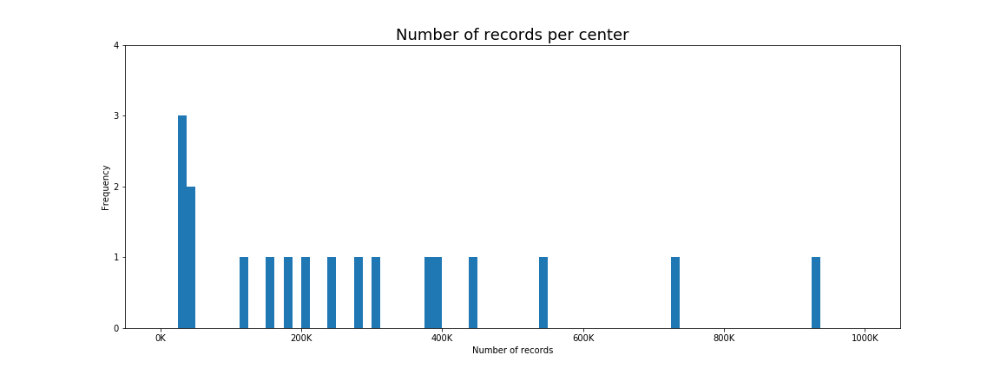
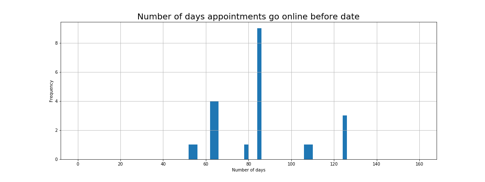
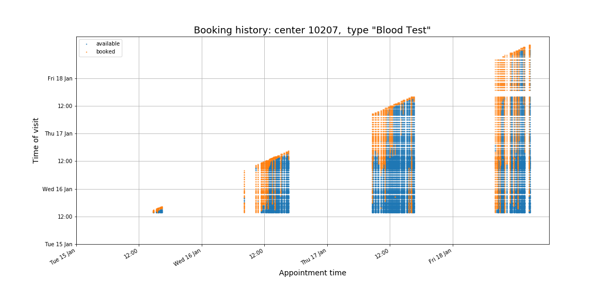
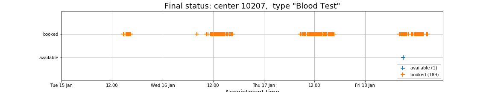
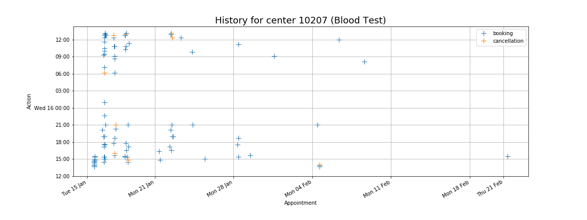

# Blood test appointment booking via UHCW's web portal #

## Context

The [University Hospitals - Coventry &
Warwickshire](https://www.uhcw.nhs.uk) (UHCW) has set up a [web
portal](https://www.swiftqueue.co.uk/uhcw.php) to facilitate the
booking of blood test appointments in Coventry (UK) from 18
participating test centers.

b

## Goals
Collecting data about the available appointments from the portal (see a
section below), in this project we aim to address the following types
of questions.

1. Which test centers have the longest or shortest wait time to the
     next available appointment?  
1. What features, such as distance to city center, are more likely to
     predict which centers are booked quicker?  
1. Are there any salient patterns in the booking and cancellation
   behavior of the patients?

**Note.** This project is in its preliminary phase.  For speed, we
work with a relatively small subset of the full dataset.

## Understanding the UHCW dataset
Details about the datasets, `appointments.csv` and `centers.csv`, are given below.  

Following is a summary of preliminary findings obtained from the
Jupyter notebook `UHCW_understanding.ipynb`.

- There are:  
  - 18 test centers,  
  - serving 2 age groups ("adult" and "child"),  
  - delivering collectively a total of 5 different test types,
    labeled:  
     - 'Blood Test'  
     - 'INR Test',  
     - 'Fasting Bloods',  
     - 'Non Fasting Bloods',  
     - 'Glucose Tolerance Test'  
- Each test center serves only 1 age group.  
- Each center delivers 1, 2, or 3 different types of test.  
- Most centers which deliver tests of multiple types put the
  appointments for all types at the same time.  
- The test centers offer a varying number of appointments.  This fact
  combine with the variability of the number of days these
  appointments are available for online booking means that the number
  of records varies across test centers, as depicted in the figure
  below.  
  
 
  
  

- The centers open their appointments for booking with a varying
  number of days ahead of time, between 52 and 125.  The distribution,
  across the test centers, is depicted in the figure below.  
  
 
  
  

## Visualizing the booking history
The **booking history** traces the status of the appointments,
i.e. whether it is "available" or "booked", across the data collection
times.  The figure below shows the booking history for one center and
test type.  

The figure only shows the booking history for appointments which have
already passed, while the dataset actually contains information on
their status in the future.

## Visualizing the final status
The **final status** refers to the last status before the appointment
and therefore indicates whether the appointment was eventually booked
or left unused.  The figure below shows that final status
corresponding to the booking history above.  

### Reconstructing the booking activity
From the booking history, we can reconstruct the **booking activity**,
which refers to the times when appointments were booked or cancelled.
The figure below shows the booking activitiy for the same center as in
the figures above.  Note however that it shows activity for
appointments in the future.

## More on the data

The dataset `centers.csv` contains the following information on each *test center*:  

1. `name`  
1. `id` number  
1. postal `address`  
1. geocoordinates (`latitude` and `longitude`)  
1. center's `web` address  
1. `appointments URL`  
1. `age group` served (children or adults)  

The dataset `appointments.csv`, too big to be hosted on this
repository, contains information on each *appointment*:

1. `appointment timestamp` (date and time of appointment)  
1. `grab timestamp` (date and time data is collected)  
1. `center id`  
1. `age group` served (children or adults)  
1. `test type` (blood test, INR test, fasting bloods, non-fasting
     bloods, glucose tolerance test)  

The dataset contained in `appointments.csv` is very large and takes
about a minute to load on a "regular" laptop.  It is available however
on [kaggle](https://www.kaggle.com/antoinechoffrut/uhcwappointments)).
More critically, it contains datetime data, which requires dealing
with timezones.  As a result, the data must be localized and
converted, and this adds a significant amount of computation.

Smaller datasets are available on this repository and contain the same
information on subsets of appointments and data collection times.  

-  The dataset `appointments-tiny.csv` is a very small dataset
containing data for appointments of an entire day for one test center
administering one test type.  It is very convenient for testing
purposes as it loads in no time, yet it contains a meaningful snapshot
of data.  
-  The dataset `appointments-less-tiny.csv` is also very small and
contains data again for appointments on one day but two test centers,
one of which administers multiple types of tests.  

## Scripts and notebooks

- The script `UHCW_scraping.py` downloads the data hourly (most of the
  time).  
- The Jupyter notebook `UHCW_understanding.ipynb` helps to understand the UHCW
  dataset.  
- The Jupyter notebook `UHCW-booking-history.ipynb` provides a
  visualization of the **booking history**, that is, whether an
  appointment is booked or available at the data collection times.
- The Jupyter notebook `UHCW_reconstruction.ipynb` reconstructs the
  **booking activity**, that is, the times when an appointnent was
  booked (thus disappearing from the dataset) or cancelled (when it reappears).  
- The file `UHCW.py` contains custom functions and classes used in the
  notebooks.  
